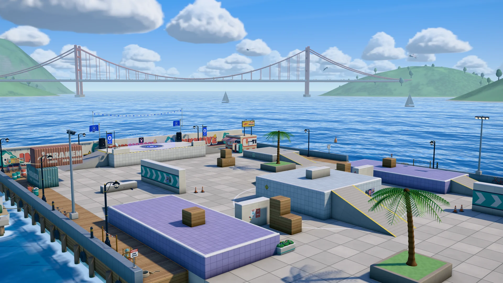

# INKWAVE — Turf Riot

> Un clone browser 3D fedele al 100% di **Splatoon** ("Turf Riot"), sviluppato come ink-shooter 4v4 in tempo reale con Three.js e Web Audio sintetico.



---

## 🎮 Caratteristiche del Gioco

- **Meccanica Ink Turf War 4v4**:
  - Dipingi il terreno, le pareti e gli ostacoli con il colore del tuo team.
  - Trasformati in calamaro (Squid form) per nuotare nell'inchiostro del tuo team a velocità triplicata, ricaricare l'inchiostro e scalare pareti verticali colorate.
  - Rallentamento e danno quando calpesti l'inchiostro nemico.
  - Splatta i nemici e conquista la percentuale di mappa maggiore prima dello scadere del tempo.
- **Mappe Disponibili**:
  - **Tidewater Plaza**: Piazza sul porto esposta al sole, con rampe, muri e copertura centrale.
  - **Kelpline Terminal**: Scalo container con passerelle a grata, fossato e gru/piattaforme sopraelevate.
  - **Halyard Marina**: Banchine galleggianti, rimorchiatore in secca e traghetto ormeggiato al centro (attenzione a non cadere in acqua!).
  - **Modalità Orario**: Giorno (Day) e Tramonto (Dusk).
- **Armi e Kit Completi**:
  - *Shooter* (Splattershot standard)
  - *Roller* (Rullo da mischia e copertura massiva)
  - *Charger* (Fucile da cecchino a carica con raggio laser)
  - *Slosher* (Secchio per getti d'inchiostro parabolici oltre le coperture)
  - *Dualies* (Doppie pistole con dodge-roll rapido)
  - *Brush* (Pennello veloce per sprintare e sferzare)
  - Armi secondarie (Sub weapons: Splat Bomb, Suction Bomb, Burst Bomb, ecc.) e Speciali.
- **Audio Procedurale a Sintesi Completa (Web Audio)**:
  - 0 file audio esterni: ogni singolo suono (sparo, impatto inchiostro, nuotata, rullo, ricarica, splat, musiche funk/rock ed effetti ambientali) è sintetizzato in tempo reale tramite oscillatori, filtri e convolutori Web Audio.
- **Grafica & Shaders Three.js**:
  - Sistema di pittura dinamica con canvas texture painting e UV unwrapping in tempo reale.
  - Lightmap AO pre-calcolate con hash layout di precisione.
  - Bloom, SSAO (GTAO), motion shake, e shader personalizzati per inchiostro liquido con riflessi speculari cubici e bordi bagnati.
  - Bot AI intelligenti con navigazione tramite grafi di waypoint, copertura territorio e combattimento.

---

## 🕹️ Comandi

| Azione | Tasto / Controllo |
|---|---|
| **Movimento** | `W`, `A`, `S`, `D` |
| **Mira / Rotazione Camera** | Mouse (Pointer Lock) |
| **Spara / Pittura** | Tasto Sinistro Mouse (LMB) |
| **Nuota nell'Inchiostro (Squid Form)** | Tasto Destro Mouse (RMB) oppure `Shift` |
| **Salto** | `Barra Spaziatrice` |
| **Arma Secondaria (Sub Weapon)** | Tasto `E` o `Q` o Tasto Centrale Mouse |
| **Special Weapon** | Tasto `F` o Click Rotella |
| **Mappa / Radar** | Tasto `Tab` o `M` |
| **Pausa / Menu** | `Esc` |

---

## 🚀 Avvio Locale

Il gioco è completamente basato su standard web moderni (ES Modules nativi e import maps), quindi può essere eseguito con qualsiasi web server statico locale.

### Con Node.js (consigliato):
```bash
npm start
```
Oppure:
```bash
npx serve -l 3000 .
```

### Con Python:
```bash
python3 -m http.server 3000
```

Apri quindi il browser su `http://localhost:3000/`.

---

## 📁 Struttura del Progetto

```
.
├── index.html                   # Entry point con importmap per Three.js
├── styles/                      # Fogli di stile CSS per HUD e Menu
│   ├── ui.css
│   └── hud.css
├── assets/                      # Risorse grafiche e font
│   ├── fonts/                   # Font Rubik e Titan One (woff2)
│   ├── lightmaps/               # Lightmap AO e metadati per le mappe
│   └── stages/                  # Anteprime HD delle mappe (giorno e tramonto)
├── vendor/three/                # Libreria Three.js e moduli JSM (postprocessing, shaders, utils)
└── src/                         # Codice sorgente del gioco (ES Modules)
    ├── main.js                  # Game loop, orchestrazione e ciclo vitale
    ├── config.js                # Bilanciamento, armi, palette colori, mappe
    ├── core/                    # Renderer, Input, Context
    ├── game/                    # Fisica, bot AI, player, armi, minimappa, telecamera
    ├── world/                   # Mappe, architettura, pittura inchiostro, shader materiali, decorazioni
    ├── fx/                      # Particelle, schizzi, onde di nuoto, postprocessing
    ├── audio/                   # Motori procedurali Web Audio per SFX e musica
    └── ui/                      # Menu, HUD, icone SVG e diorama
```
